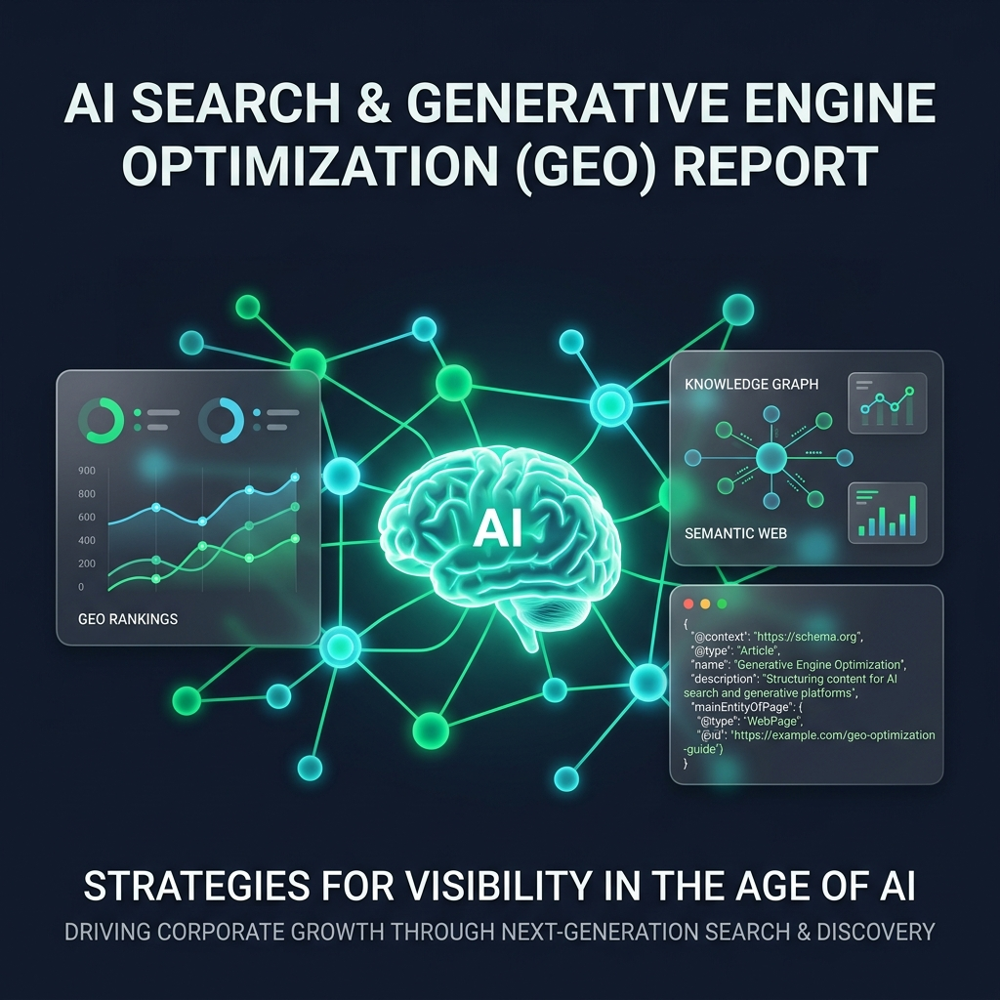
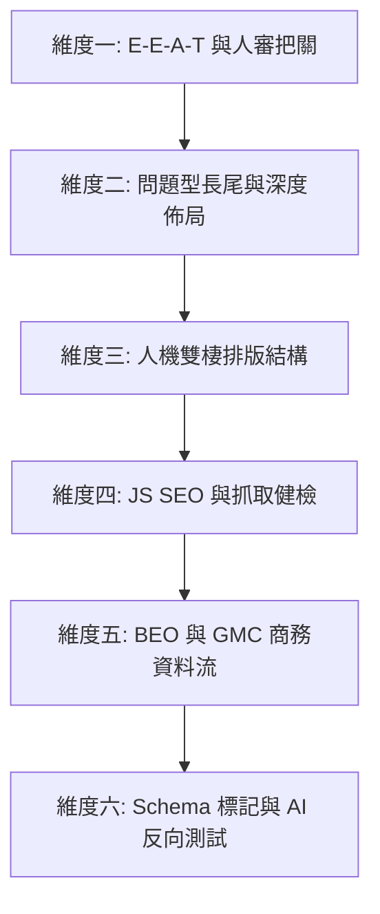
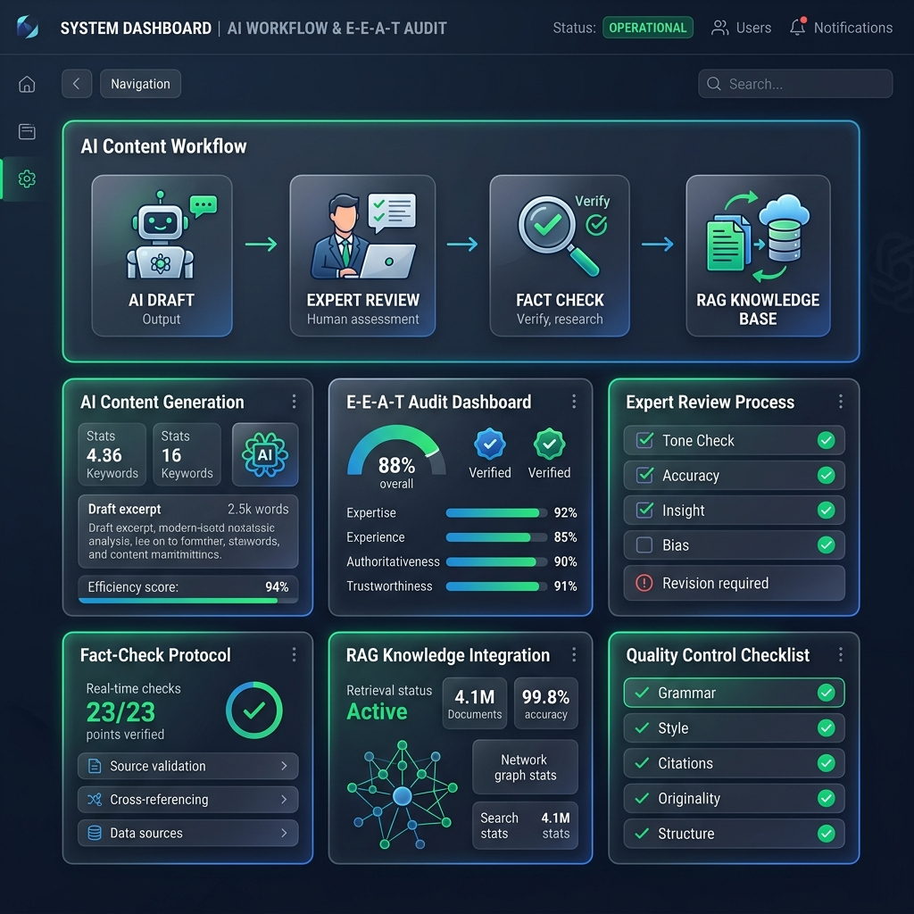
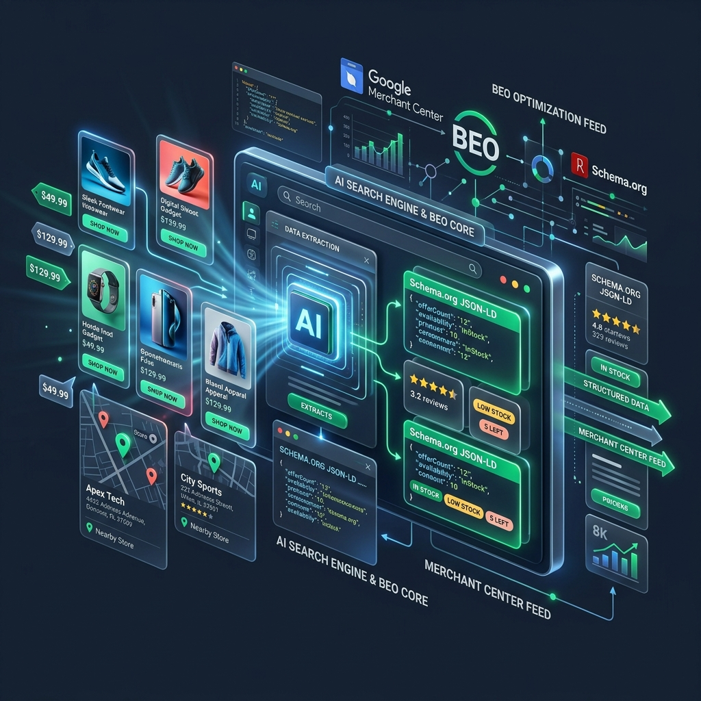
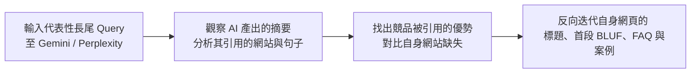

# ▍Google AI 搜尋與生成式引擎優化 (GEO/BEO) 企業級實戰規範與 SOP

> **文檔定位**：本規範報告旨在為跨專案開發團隊、SEO 專家及 AI Agent (Agi) 提供標準化的操作指南。將傳統 SEO 基礎與生成式 AI 搜尋 (AI Overviews, RAG) 深度整合，確保品牌在 AI 搜尋時代獲得極致的能見度與商務轉換。

---



---

## Executive Summary 執行摘要與戰略思維

Google 官方優化指南與專家實戰經驗明確指出核心法則：**「傳統 SEO 仍然有效，但必須用 AI 搜尋的思維做質的升級。」** 

### 💡 核心戰略轉變
1. **不亂改技術底層，不迷信新標籤**：不需要花費資源生成 `llms.txt` 或追求奇特的 AI 專屬標記，而是回歸紮實的 W3C 語意化 HTML 與 Schema.org 結構化資料。
2. **從「給人看」升級為「給人 + AI 看」**：AI 模型在生成摘要前會橫向掃描並提取網頁片段。網頁內容必須具備高度的「可摘取性 (Excerpt-friendly)」，透過清晰的標題結構、首句直答與表格清單來服務 RAG 爬蟲。
3. **從「One-shot 量產」轉向「專家品味把關」**：過於自動化、缺乏真實觀點的 AI 農場文將被邊緣化；具備真實經驗 (Experience)、獨特數據與案例背書的內容才能贏得 AI 搜尋的青睞。

---

## Matrix 核心策略對比矩陣：要加強 vs. 要改變

| 策略維度 | 🚀 要加強的部分 (維持但深化) | 🔄 要改變的部分 (行為與流程重構) |
| :--- | :--- | :--- |
| **內容品質與信任 (E-E-A-T)** | • **真實案例與數據背書**：文章與產品頁需融入實戰數據與在地案例。<br>• **作者與信譽標示**：明確呈現專業背景、證照與實績，建立高信譽來源。 | • **改變 AI 產製流程**：淘汰 One-shot 產文。導入「AI 草稿 ➔ 人工優化結構 ➔ AI 潤飾 ➔ SOP 檢核表」的多輪協作。 |
| **搜尋定位與關鍵字** | • **鎖定問題型長尾關鍵字**：聚焦具體痛點與情境（如：「如何在台灣做 LINE 機器人 AI SEO」）。 | • **改變內容定位**：減少低質重複的迷你頁面；轉向「1 個主頁 + 清單導向」的深度長文 (1500-3000字以上)。 |
| **內容結構與排版** | • **H2/H3 清晰架構**：善用階層標題、清單與表格，讓 AI 輕鬆鎖定答案句與重點段落。 | • **改變段落撰寫習慣**：每個 H2 主題實施「首句直答問題 + 2-3段具體步驟 + 清單/表格 + 結尾小結句」。 |
| **技術基礎與抓取力** | • **JS SEO 最佳實務**：針對 SPA/JS 站落實預渲染、SSR 或動態渲染，確保 Googlebot 能無障礙抓取。 | • **改變對 Vibe Coding 的盲信**：杜絕首屏空白、依賴 JS 載入內容的弊端；定期使用 GSC 與 Lighthouse 檢測抓取延遲。 |
| **商務曝光 (BEO)** | • **本地與電商資訊完整度**：產品頁落實精確價格、庫存與評價；維護 Google 商家 (GBP) 與 GMC Feed。 | • **改變單純網頁文字賣貨思維**：將地理性關鍵字與使用情境（如「台北商家適用」）融入產品頁與 Feed 資訊流中。 |
| **結構化資料與測試** | • **全方位 Schema 標記**：主頁部署 `Article`，問答區部署 `FAQPage`，產品頁部署 `Product` + `AggregateRating`。 | • **改變 SEO 測試手法**：不只看傳統 Google 排名；使用 Gemini/Perplexity 反向測試 AI 摘要，觀察引用來源並調優。 |

---

## SOP 六大維度深度優化 SOP 與實施細則



---

### 維度一：內容品質與信任度 (E-E-A-T) & 人審把關 SOP

在 AI 搜尋時代，搜尋引擎會過濾大量農場文，優先選擇具備真實經驗的「信譽高來源」進行整合。



#### 1. 信任度資產建設 (Trust Assets)
* **專業背景標示**：在文章頂部/底部放置清晰的作者欄 (Author Box)，連結至詳細的作者履歷頁，列出專業證照、過往主導專案與實戰資歷。
* **真實數據背書**：內容必須包含自行測試的數據、客戶成功案例截圖或產業權威白皮書的引用連結。

#### 2. 「多輪 AI + 人審」寫作工作流 SOP
嚴禁使用單一提示詞直接生成文章。必須遵循以下四階段協作流程：

```
[Phase 1: 資料蒐集與觀點注入] (人工提供在地案例、實戰數據、獨特觀點)
              │
              ▼
[Phase 2: AI 生成結構大綱] (AI 依據資料生成具備深度邏輯的大綱)
              │
              ▼
[Phase 3: 人工優化與分段撰寫] (人工調整架構，讓 AI 逐段擴充並融入專業術語)
              │
              ▼
[Phase 4: 人審品質檢查表把關] (編輯依據 Checklist 進行事實查核與去機械音)
```

#### 📋 內容品質檢查表 (Quality Checklist)
- [ ] **是否包含真實經驗？**（有無融入台灣/在地案例、項目實測經驗或真實痛點？）
- [ ] **是否具備具體步驟？**（是否提供可落地的 Step-by-step 教學，而非空泛概念？）
- [ ] **是否有數字與案例支撐？**（主觀論述是否附帶明確的數據、轉化率或對比圖表？）
- [ ] **是否消除空泛行銷話術？**（是否已刪除「總而言之」、「值得注意的是」、「無庸置疑」等 AI 冗詞？）

---

### 維度二：搜尋定位與關鍵字策略 (Query Fan-out)

AI 搜尋擅長處理複雜的長語句，並將用戶提問展開為多個子議題。

#### 1. 鎖定「問題型長尾關鍵字」
* 傳統 SEO 鎖定短詞（如：「LINE 機器人」）。
* GEO 升級鎖定精準痛點與意圖（如：「如何在台灣做 LINE 機器人 AI SEO」、「單店門市如何透過 AI 系統自動化拉新」）。

#### 2. 深度主題叢集 (Topic Clusters) 佈局
* **拋棄迷你頁面**：停止建立大量內容薄弱、重複的 SEO 小頁面。
* **1 主頁 + 清單導向**：圍繞核心業務建立 1500 - 3000 字以上的「終極指南 (Ultimate Guide)」。
* **模組化分段**：長文內部的每個子標題區塊都應視為一個獨立的知識切片，確保 AI 在進行 RAG 檢索時能直接單獨摘取該段落。

---

### 維度三：給人 + AI 看的雙棲排版規範

AI 模型更偏好結構極度清晰、主題明確且具備摘要特徵的 HTML 結構。

#### 1. H2/H3 結構與「首句直答 (BLUF)」法則
每個 H2 或 H3 子章節必須遵循以下結構公式：
1. **首句直答 (Summary Sentence)**：標題下方的第一段（前 50 字）必須是一句直接回答該標題問題的精煉總結句。
2. **主體說明 (Body Paragraphs)**：接著以 2-3 段文字進行具體情境說明或原理解釋。
3. **結構化呈現 (Structured Data)**：強制加入清單 (`-` 或 `1. 2. 3.`) 或表格 (`<table>` 規格比較、優缺點對比)。
4. **結尾小結句 (Closing Takeaway)**：在章節末尾放置一句粗體小結，方便 AI 快速抽取作為摘要句。

#### 2. 導覽與錨點設計
* **懸浮目錄 (Sticky TOC)**：長篇內容必須具備目錄導覽，並為每個標題設定清晰的 HTML ID 錨點（如 `<h2 id="ai-seo-strategies">`），利於爬蟲理解文章脈絡並精準定位段落。

---

### 維度四：技術基礎與可抓取性健檢 (Technical & JS SEO)

Vibe Coding 與低代碼工具常產生 SPA (單頁應用) 或純 CSR (客戶端渲染) 網站，導致 Googlebot 在初次爬取時只看到空白首屏，嚴重影響 AI 搜尋收錄。

#### 1. JS 網站渲染規範
* **落實伺服器端渲染 (SSR / SSG)**：若使用 React / Vue 等框架，務必採用 Next.js、Nuxt 或 Astro 進行預渲染，確保檢視 HTML 原始碼時，核心內文與導覽列已經存在。
* **動態渲染與 Lazy Loading 處理**：確保重要內容不依賴使用者捲動或點擊事件才會載入；圖片與次要元件可設定 `loading="lazy"`，但文字區塊必須隨 DOM 初始載入。

#### 2. 定期健檢 SOP 與工具
* **Google Search Console (GSC) 檢測**：每月使用「網址檢查 ➔ 測試即時網址 ➔ 檢視測試網頁 ➔ 螢幕截圖與 HTML 原始碼」，確認 Googlebot 看到的畫面與真實使用者一致。
* **第三方工具診斷**：定期使用 Lighthouse、Ahrefs 或 Screaming Frog 進行站內審查，檢查是否有 JS 執行逾時、孤兒頁面 (Orphan Pages)、無效 Canonical 或 Sitemap 錯誤。

---

### 維度五：商務曝光與本地電商資訊流 (BEO)

在商業查詢中，AI Overviews 會直接拉取 Google 商家檔案與商品資料庫生成互動式推薦卡片。



#### 1. 串接 Google Merchant Center (GMC) Feed
* **資料庫一致性**：確保網站電商後台與 GMC Feed 保持即時同步。
* **產品頁必備要素**：產品頁面必須具備明確且機器可讀的：精準價格、幣別、即時庫存狀態 (InStock/OutOfStock)、真實用戶評價與清晰的分類階層標籤。

#### 2. 融入「地理性關鍵字」與「使用情境」
* 單純寫「AI 系統功能介紹」是不夠的。必須在產品頁與部落格文章中，自然融入在地化與情境化詞彙。
* *範例示範*：「在**台北**幫實體餐飲商家做 LINE 機器人 AI SEO」、「適合**台灣單店門市**的自動化行銷系統」。

---

### 維度六：結構化資料 (Schema.org) 與 AI 反向測試

AI 爬蟲依賴 Schema 結構化資料來快速判別網頁實體 (Entities) 與屬性。

#### 1. 核心 Schema 標記部署指南
所有專案必須在 HTML `<head>` 或 `<body>` 內植入乾淨的 JSON-LD 結構化資料：

* **主圖文頁 / 深度教學頁**：強制部署 `Article` 或 `TechArticle` 標記，包含作者、出版日期與核心摘要。
* **常見問題區塊**：強制部署 `FAQPage` 標記，將問題與答案明確配對。
* **產品 / 服務頁面**：強制部署 `Product` 標記，並關聯 `AggregateRating` (平均評分) 與 `Offer` (定價與庫存)。
* **全站導覽**：部署 `BreadcrumbList` 標記，強化階層關係。

#### 💻 FAQPage JSON-LD 範例
```html
<script type="application/ld+json">
{
  "@context": "https://schema.org",
  "@type": "FAQPage",
  "mainEntity": [{
    "@type": "Question",
    "name": "傳統 SEO 對生成式 AI 搜尋仍然適用嗎？",
    "acceptedAnswer": {
      "@type": "Answer",
      "text": "答案是肯定的。傳統 SEO 的核心原則依然適用，但必須透過 RAG 友善的語意結構與實體優化，讓內容更容易被 AI 搜尋引擎擷取與摘要。"
    }
  }]
}
</script>
```

---

#### 2. 實戰測試手法：AI 模擬 AI 模式 (Reverse RAG Testing)
不要被動等待 Google 演算法更新，應主動使用 AI 工具進行反向工程測試。



**測試操作 SOP：**
1. 打開 Gemini Advanced 或 Perplexity。
2. 輸入品牌鎖定的問題型長尾關鍵字（例如：「台北單店門市如何用 AI 系統做自動化行銷？」）。
3. **深度觀察**：檢視 AI 生成的答案結構，並仔細檢視其**引用來源 (Citations)**。觀察 AI 挑選了哪些網站？擷取了哪一段文字？是因為該段落有清晰的列表，還是因為有具體數據？
4. **反向優化**：根據觀察結果，立即修改自身網站對應頁面的 H2 標題、首句直答文字、FAQ 結構與數字案例，並提交 GSC 重新檢索。

---

## Summary 快速行動總結表 (Quick Action Guide)

團隊成員可依照下表進行快速自我審查與專案迭代：

| 領域方向 | ❌ 原本傳統做法 | 🎯 建議加強 / 改變的 GEO 做法 |
| :--- | :--- | :--- |
| **內容品質** | 用 AI 一路生成到底，極少人工檢查 | 實施「多輪 AI + 人審」，強制加入實戰案例、真實數據與作者信譽背書 |
| **搜尋定位** | 以傳統大單字、高搜尋量關鍵字為主 | 鎖定「問題型長尾關鍵字」，針對用戶痛點提供完整且結構化的解決方案 |
| **技術基礎** | 過度依賴 JS 框架 (Vibe coding)，忽視底層 SEO | 強化 JS SEO，落實預渲染/SSR，確保 Googlebot 能秒抓取內容且無延遲 |
| **BEO / 電商** | 產品頁僅放置基本的圖片與文字描述 | 完善 GMC Feed 串接，植入完整 Product Schema，並融入地理與情境關鍵字 |
| **內容結構** | 缺乏層次的長篇大論或單一文字段落 | 採用 H2/H3 分主題，落實「首句直答 + 列表/表格 + 小結句」的人機雙棲排版 |
| **工具與流程** | 用 AI 一次產出全部內容便發布上線 | 定期用 Gemini/Perplexity 進行反向測試，觀察 AI 摘要偏好並持續調優網頁 |

---
*文檔維護與更新：本規範隨 Google 搜尋中心最新生成式 AI 指南持續迭代。各專案 Agi 應以此文檔作為網站生成與內容審核的底層邏輯。*
